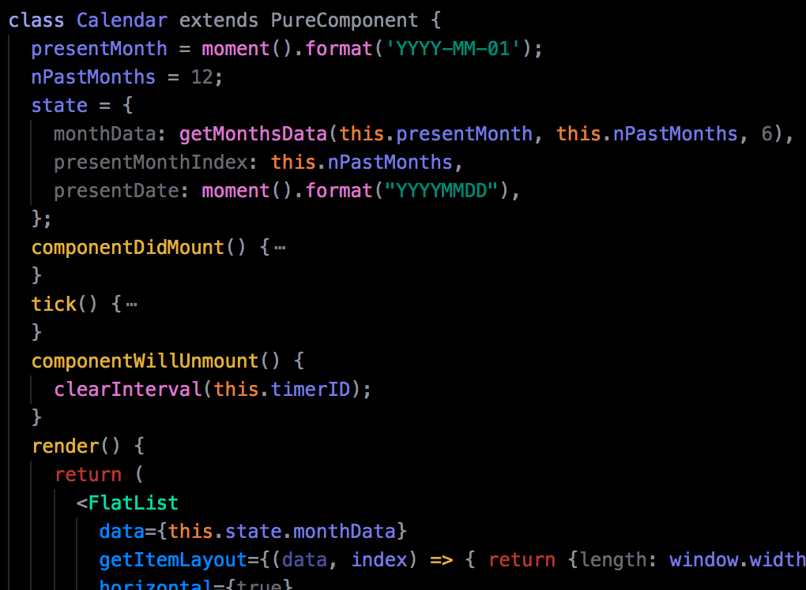
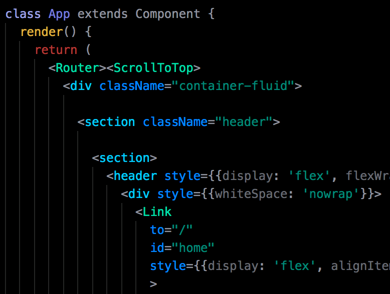
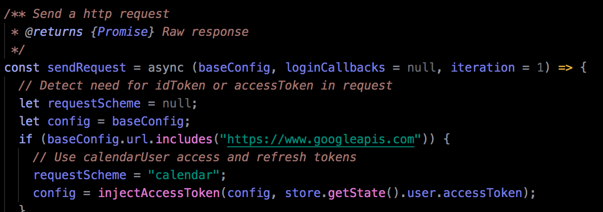

# Psychedelic Comedown Theme
A stimulating but fulfilling psychedelic-come-down theme for VSCode
https://marketplace.visualstudio.com/items?itemName=gerbus-enterprises.psychedelic-comedown

Based on the Pastel On Dark color scheme from codeanywhere.com . Tested primarily using React.

### Features
* sets a cool (purple, blue, green) visual context
* highlights function definitions (yellow) and function calls (orange)
* contrasts `js` (purple/orange) from `jsx` (blue/green)
* differentiates Components (teal) from html elements (cyan)

### Samples
#### React Native

#### React

#### ES6

